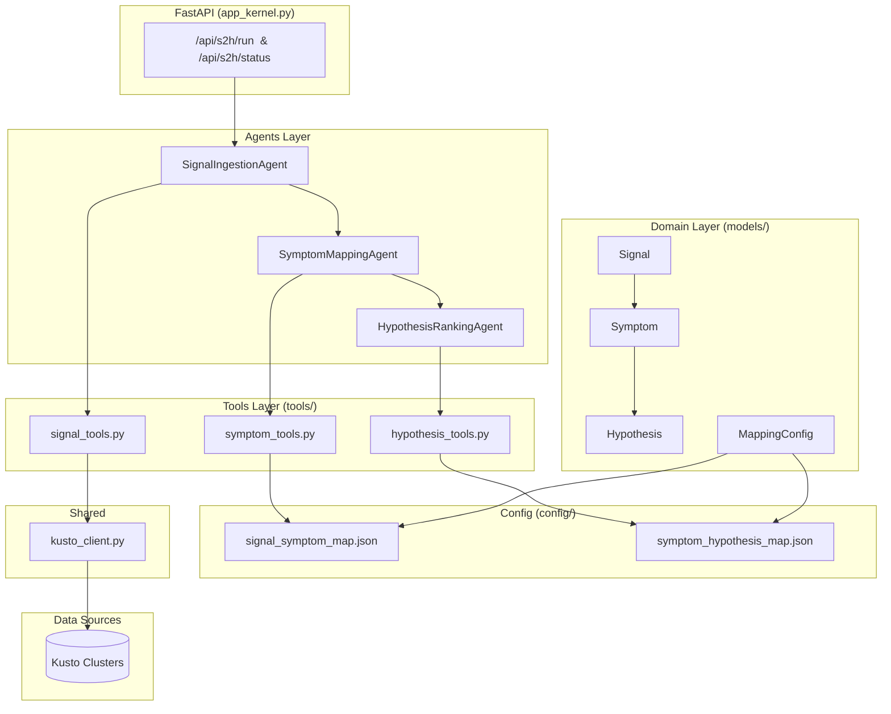
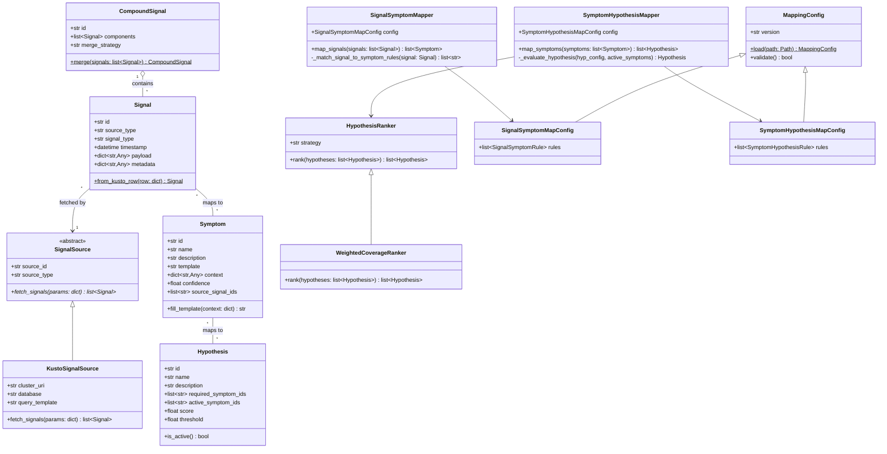
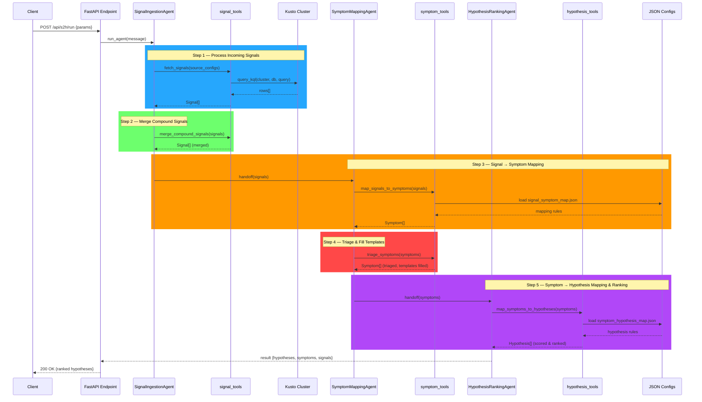
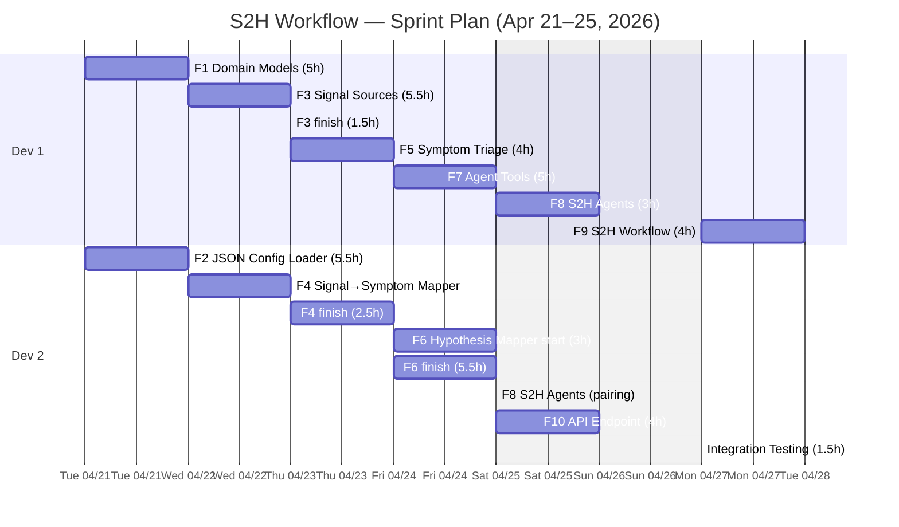

# Signal-Symptom-Hypothesis Agentic Workflow — Development Plan

**Epic:** 37477062
**Repo:** RATIO-AI
**Authors:** rbhuyan, jmarrocco
**Date:** 2026-04-17

---

## 1. Executive Summary

This project builds an agentic workflow within the RATIO-AI agents service that continuously processes incoming **Signals** (data points from Kusto clusters and other sources), maps them to predefined **Symptoms** (observable patterns/conditions), and maps those Symptoms to **Hypotheses** (likely root causes). The entire Signal → Symptom → Hypothesis pipeline is configurable via JSON files, supports many-to-many relationships at every level, and uses a ranking algorithm to surface the most probable hypothesis when multiple candidates are active.

The workflow integrates with the existing Agent Framework architecture — new agents, tools, and orchestration builders slot into `Code/Servers/agents/` alongside the current `ManagerAgent`, `DataAnalystAgent`, and friends.

---

## 2. Architecture

### 2.1 Component Diagram — Integration with RATIO-AI



### 2.2 Class Diagram — Domain Model



### 2.3 Sequence Diagram — End-to-End Flow



---

## 3. Domain Model

### 3.1 Core Domain Objects

| Object | Purpose | Design Pattern |
|--------|---------|----------------|
| `Signal` | Immutable data point from an external source. Carries `payload` (raw data) and `metadata` (source info, timestamps). | Value Object |
| `CompoundSignal` | Aggregation of related singular signals into one composite. Used when multiple raw events represent a single logical signal. | Composite |
| `Symptom` | Observable pattern/condition derived from one or more signals. Has a `template` string with `{placeholders}` filled from signal context. | Template Method |
| `Hypothesis` | A potential root cause or explanation. Activated when its required symptoms are present. Scored by a ranker. | — |
| `SignalSource` | Abstract interface for fetching signals from external systems. | Strategy / Abstract Factory |
| `KustoSignalSource` | Concrete signal source backed by a Kusto cluster. Uses `Code.Shared.clients.kusto_client`. | Strategy |
| `SignalSymptomMapper` | Evaluates signals against configurable rules to produce symptoms. | Strategy |
| `SymptomHypothesisMapper` | Evaluates active symptoms against hypothesis definitions. | Strategy |
| `HypothesisRanker` | Abstract ranker interface. Pluggable strategy for scoring and ordering hypotheses. | Strategy |
| `WeightedCoverageRanker` | Default ranker: scores hypotheses by (matched symptoms / required symptoms) × confidence weight. | Strategy |
| `MappingConfig` | Loads and validates JSON configuration files. | Factory Method |

### 3.2 Pydantic Models

All domain objects are `pydantic.BaseModel` subclasses, following the RATIO-AI convention. Each class lives in its own file under `Code/Servers/agents/models/` for clarity (one class per file).

```python
# Example shapes (final implementation in Feature F3)

class Signal(BaseModel):
    id: str = Field(default_factory=lambda: str(uuid4()))
    source_type: str
    signal_type: str
    timestamp: datetime
    payload: dict[str, Any]
    metadata: dict[str, Any] = Field(default_factory=dict)

class Symptom(BaseModel):
    id: str
    name: str
    description: str
    template: str  # e.g. "SR spike detected: {count} SRs in {window} for {service}"
    context: dict[str, Any] = Field(default_factory=dict)
    confidence: float = Field(ge=0.0, le=1.0, default=1.0)
    source_signal_ids: list[str] = Field(default_factory=list)

class Hypothesis(BaseModel):
    id: str
    name: str
    description: str
    required_symptom_ids: list[str]
    active_symptom_ids: list[str] = Field(default_factory=list)
    score: float = Field(ge=0.0, le=1.0, default=0.0)
    threshold: float = Field(ge=0.0, le=1.0, default=0.5)
```

---

## 4. JSON Configuration Schema

### 4.1 Signal Source Configuration — `signal_sources.json`

Defines which data sources to poll and how to convert raw rows into `Signal` objects.

```json
{
  "version": "1.0",
  "sources": [
    {
      "source_id": "sr_spike",
      "source_type": "kusto",
      "signal_type": "sr_volume_spike",
      "cluster": "https://icmdataro.centralus.kusto.windows.net",
      "database": "Common",
      "query_template": "GetBase_QCO_Outages() | where CreateDate > ago({lookback}) | summarize SRCount=count() by OwningServiceName, bin(CreateDate, {bin_size})",
      "parameters": {
        "lookback": "1h",
        "bin_size": "5m"
      },
      "field_mappings": {
        "service": "OwningServiceName",
        "count": "SRCount",
        "timestamp": "CreateDate"
      }
    },
    {
      "source_id": "active_outage",
      "source_type": "kusto",
      "signal_type": "outage_declared",
      "cluster": "https://outageandcommswest.kusto.windows.net",
      "database": "Outage",
      "query_template": "ActiveOutages | where Status == 'Active' | project OutageId, ServiceName, ImpactStartTime, Severity",
      "parameters": {},
      "field_mappings": {
        "outage_id": "OutageId",
        "service": "ServiceName",
        "impact_start": "ImpactStartTime",
        "severity": "Severity"
      }
    }
  ]
}
```

### 4.2 Signal → Symptom Mapping — `signal_symptom_map.json`

Defines rules for which signal types map to which symptoms, including conditions and context extraction.

```json
{
  "version": "1.0",
  "rules": [
    {
      "rule_id": "sr_spike_to_symptom",
      "signal_types": ["sr_volume_spike"],
      "conditions": {
        "field": "count",
        "operator": ">=",
        "value": 10
      },
      "produces_symptom": "sr_surge",
      "context_extract": {
        "count": "$.payload.count",
        "service": "$.payload.service",
        "window": "$.metadata.bin_size"
      }
    },
    {
      "rule_id": "outage_to_symptom",
      "signal_types": ["outage_declared"],
      "conditions": {
        "field": "severity",
        "operator": "in",
        "value": ["0", "1", "2"]
      },
      "produces_symptom": "active_sev_outage",
      "context_extract": {
        "outage_id": "$.payload.outage_id",
        "service": "$.payload.service",
        "severity": "$.payload.severity"
      }
    }
  ],
  "symptoms": {
    "sr_surge": {
      "name": "Support Request Surge",
      "description": "Abnormal spike in support request volume for a service",
      "template": "SR spike detected: {count} SRs in {window} for {service}"
    },
    "active_sev_outage": {
      "name": "Active Severity Outage",
      "description": "An active Sev 0/1/2 outage has been declared",
      "template": "Outage {outage_id} (Sev {severity}) active for {service}"
    }
  }
}
```

### 4.3 Symptom → Hypothesis Mapping — `symptom_hypothesis_map.json`

Defines hypotheses, their required symptoms, and scoring weights.

```json
{
  "version": "1.0",
  "hypotheses": [
    {
      "hypothesis_id": "outage_driving_sr_spike",
      "name": "Outage Driving SR Spike",
      "description": "An active outage is causing a correlated surge in support requests",
      "required_symptoms": ["sr_surge", "active_sev_outage"],
      "match_conditions": {
        "service": "exact_match"
      },
      "weights": {
        "sr_surge": 0.6,
        "active_sev_outage": 0.4
      },
      "threshold": 0.5
    },
    {
      "hypothesis_id": "isolated_sr_spike",
      "name": "Isolated SR Spike (No Outage)",
      "description": "SR volume spike with no correlated outage — may indicate an undeclared issue",
      "required_symptoms": ["sr_surge"],
      "anti_symptoms": ["active_sev_outage"],
      "weights": {
        "sr_surge": 1.0
      },
      "threshold": 0.7
    }
  ]
}
```

---

## 5. Feature Breakdown

All features are children of **Epic 37477062**. Each is scoped to be a single ADO Feature work item.

---

### F1 — Domain Models & Pydantic Schemas

**Description:** Define all core domain objects as Pydantic v2 models: `Signal`, `CompoundSignal`, `Symptom`, `Hypothesis`. Each class in its own file for clarity.

**Approach:**
- One class per file under `models/`
- Use `Field(...)` with constraints (`ge`, `le`, `min_length`, etc.)
- Include `from_kusto_row()` class method on `Signal`
- Include `fill_template()` on `Symptom`
- Add `models/__init__.py` to re-export all models for convenient imports

**Acceptance Criteria:**
- [ ] All 4 model classes defined with full type annotations, each in its own file
- [ ] `Signal.from_kusto_row()` converts a Kusto result dict to a Signal
- [ ] `Symptom.fill_template()` renders the template with context values
- [ ] `Hypothesis.is_active()` returns `True` when score ≥ threshold
- [ ] Unit tests for each model class (one test file per model)

**Files:**
- Create: `models/__init__.py`
- Create: `models/signal.py` — `Signal` class
- Create: `models/compound_signal.py` — `CompoundSignal` class
- Create: `models/symptom.py` — `Symptom` class
- Create: `models/hypothesis.py` — `Hypothesis` class
- Create: `tests/test_signal.py`
- Create: `tests/test_compound_signal.py`
- Create: `tests/test_symptom.py`
- Create: `tests/test_hypothesis.py`

**Effort:** 5 hours

---

### F2 — JSON Configuration Loader

**Description:** Implement the config schema classes and loader, each in its own file. One class per file for the config schemas, plus a standalone `config_loader.py` for loading/validation logic.

**Approach:**
- One Pydantic config class per file under `config/`
- `config_loader.py` — standalone loader function with `load()`, `validate()`, and `reload()` methods
- Use `model_validate_json()` for loading
- Validate at load time (unknown symptom references, circular dependencies, missing required fields)
- Config files go in `config/s2h_mappings/`
- Add `config/__init__.py` to re-export all config classes

**Acceptance Criteria:**
- [ ] All three JSON schemas load and validate without error
- [ ] Invalid configs raise clear `ValidationError` messages
- [ ] Cross-reference validation: symptom IDs in hypothesis rules must exist in the symptom definitions
- [ ] Hot-reload support: `reload()` method re-reads from disk
- [ ] Unit tests with valid and invalid JSON fixtures (one test file per config class)

**Files:**
- Create: `config/__init__.py`
- Create: `config/mapping_config.py` — `MappingConfig` base class
- Create: `config/signal_source_config.py` — `SignalSourceConfig` schema
- Create: `config/signal_symptom_map_config.py` — `SignalSymptomMapConfig` + `SignalSymptomRule`
- Create: `config/symptom_hypothesis_map_config.py` — `SymptomHypothesisMapConfig` + `SymptomHypothesisRule`
- Create: `config/config_loader.py` — standalone loader/validator/reloader
- Create: `config/s2h_mappings/signal_sources.json`
- Create: `config/s2h_mappings/signal_symptom_map.json`
- Create: `config/s2h_mappings/symptom_hypothesis_map.json`
- Create: `tests/test_signal_source_config.py`
- Create: `tests/test_signal_symptom_map_config.py`
- Create: `tests/test_symptom_hypothesis_map_config.py`
- Create: `tests/test_config_loader.py`

**Effort:** 6 hours

---

### F3 — Signal Source Abstraction & Kusto Implementation

**Description:** Implement the `SignalSource` abstract base class, the `KustoSignalSource` concrete implementation, and the `SignalSourceFactory` — each in its own file.

**Approach:**
- `services/signal_source.py` — `SignalSource` ABC with `async fetch_signals(params) -> list[Signal]`
- `services/kusto_signal_source.py` — `KustoSignalSource` using `query_kql_async` from `Code.Shared.clients.kusto_client`
- `services/signal_source_factory.py` — `SignalSourceFactory` that creates sources from `signal_sources.json` entries
- Template parameters in `query_template` are rendered with Python `str.format_map()`
- Each source converts Kusto rows to `Signal` objects via `field_mappings`
- Add `services/__init__.py` to re-export service classes

**Acceptance Criteria:**
- [ ] `KustoSignalSource.fetch_signals()` queries Kusto and returns `Signal` objects
- [ ] Query templates are parameterized (no string concatenation of user input into KQL)
- [ ] Field mappings correctly extract payload fields from Kusto row dicts
- [ ] `SignalSourceFactory.create(config)` returns the correct source type
- [ ] Errors from Kusto are caught and logged, not swallowed silently
- [ ] Unit tests with mocked Kusto client (one test file per class)

**Files:**
- Create: `services/__init__.py`
- Create: `services/signal_source.py` — `SignalSource` ABC
- Create: `services/kusto_signal_source.py` — `KustoSignalSource`
- Create: `services/signal_source_factory.py` — `SignalSourceFactory`
- Create: `tests/test_signal_source.py`
- Create: `tests/test_kusto_signal_source.py`
- Create: `tests/test_signal_source_factory.py`

**Effort:** 7 hours

---

### F4 — Signal-to-Symptom Mapper

**Description:** Implement the `SignalSymptomMapper` that evaluates incoming signals against the rules in `signal_symptom_map.json` and produces `Symptom` objects with filled context.

**Approach:**
- Create `services/signal_symptom_mapper.py`
- Evaluate each signal against all matching rules (by `signal_types`)
- Apply condition evaluation (operators: `>=`, `<=`, `==`, `!=`, `in`, `not_in`)
- Extract context fields from signal payload using JSONPath-like dotted paths
- Fill symptom templates with extracted context
- Support compound signals: merge step runs before mapping

**Acceptance Criteria:**
- [ ] Signals matching multiple rules produce multiple symptoms
- [ ] Conditions support all 6 operators
- [ ] Context extraction populates symptom template placeholders
- [ ] Compound signal merging groups signals by configurable key (e.g., service + time window)
- [ ] Unit tests for each operator and for multi-rule matching

**Files:**
- Create: `services/signal_symptom_mapper.py`
- Create: `tests/test_signal_symptom_mapper.py`

**Effort:** 8 hours

---

### F5 — Symptom Triage & Template Filling

**Description:** Implement symptom triage logic that filters, deduplicates, and enriches symptoms before passing them to the hypothesis mapper.

**Approach:**
- Add triage logic within `services/signal_symptom_mapper.py` or as a separate `services/symptom_triage.py`
- Deduplication: if the same symptom ID appears multiple times (from different signals), merge their `source_signal_ids` and take the highest confidence
- Context enrichment: fill any remaining template placeholders with defaults or "unknown"
- Priority ordering: sort symptoms by confidence descending

**Acceptance Criteria:**
- [ ] Duplicate symptoms are merged (not dropped — signal IDs are combined)
- [ ] Template placeholders with missing context get a default value
- [ ] Symptoms are returned sorted by confidence
- [ ] Unit tests for dedup, enrichment, and ordering

**Files:**
- Create or extend: `services/symptom_triage.py`
- Create: `tests/test_symptom_triage.py`

**Effort:** 4 hours

---

### F6 — Symptom-to-Hypothesis Mapper & Ranker

**Description:** Implement `SymptomHypothesisMapper`, `HypothesisRanker` (ABC), and `WeightedCoverageRanker` — each in its own file.

**Approach:**
- `services/symptom_hypothesis_mapper.py` — `SymptomHypothesisMapper` class
- `services/hypothesis_ranker.py` — `HypothesisRanker` abstract base class
- `services/weighted_coverage_ranker.py` — `WeightedCoverageRanker` concrete implementation
- For each hypothesis definition, check which required symptoms are present in the active set
- Apply `match_conditions` (e.g., symptoms must share the same `service` value)
- Score = Σ(weight_i × confidence_i for each matched symptom) / Σ(all weights)
- Apply `anti_symptoms` — if any anti-symptom is present, suppress the hypothesis
- `WeightedCoverageRanker` sorts by score descending, filters by threshold
- `HypothesisRanker` is abstract — future implementations can swap in ML-based rankers

**Acceptance Criteria:**
- [ ] Hypothesis with all required symptoms present gets score > threshold → active
- [ ] Hypothesis missing required symptoms gets proportionally lower score
- [ ] Anti-symptoms correctly suppress a hypothesis
- [ ] Match conditions (e.g., same service) are enforced
- [ ] Multiple hypotheses can be active simultaneously
- [ ] Ranker returns hypotheses sorted by score
- [ ] Unit tests per class (one test file per service file)

**Files:**
- Create: `services/symptom_hypothesis_mapper.py` — `SymptomHypothesisMapper`
- Create: `services/hypothesis_ranker.py` — `HypothesisRanker` ABC
- Create: `services/weighted_coverage_ranker.py` — `WeightedCoverageRanker`
- Create: `tests/test_symptom_hypothesis_mapper.py`
- Create: `tests/test_hypothesis_ranker.py`
- Create: `tests/test_weighted_coverage_ranker.py`

**Effort:** 9 hours

---

### F7 — Agent Tools (`@tool` functions)

**Description:** Create the `@tool`-decorated functions that agents call during the workflow. These are thin wrappers around the domain services.

**Approach:**
- `tools/signal_tools.py` — `fetch_signals`, `merge_compound_signals`
- `tools/symptom_tools.py` — `map_signals_to_symptoms`, `triage_symptoms`
- `tools/hypothesis_tools.py` — `map_symptoms_to_hypotheses`, `get_ranked_hypotheses`
- Each tool returns JSON (matching the existing `kusto_tools.py` pattern)
- Tools use `Annotated[..., Field(description=...)]` for all parameters

**Acceptance Criteria:**
- [ ] All tools follow the `@tool(approval_mode="never_require")` pattern
- [ ] Tools accept/return JSON strings (like `kusto_tools.py`)
- [ ] Each file exposes an `ALL_*_TOOLS` list
- [ ] Tools handle errors gracefully (return error JSON, don't raise)
- [ ] Unit tests for each tool function

**Files:**
- Create: `tools/signal_tools.py` — `fetch_signals`, `merge_compound_signals`
- Create: `tools/symptom_tools.py` — `map_signals_to_symptoms`, `triage_symptoms`
- Create: `tools/hypothesis_tools.py` — `map_symptoms_to_hypotheses`, `get_ranked_hypotheses`
- Create: `tests/test_signal_tools.py`
- Create: `tests/test_symptom_tools.py`
- Create: `tests/test_hypothesis_tools.py`

**Effort:** 5 hours

---

### F8 — S2H Agents (3 agents + registration)

**Description:** Create the three specialist agents and register them in the agent factory.

**Approach:**
- `agents/signal_ingestion_agent.py` — `SignalIngestionAgent` with `signal_tools`
- `agents/symptom_mapping_agent.py` — `SymptomMappingAgent` with `symptom_tools`
- `agents/hypothesis_ranking_agent.py` — `HypothesisRankingAgent` with `hypothesis_tools`
- Each extends `BaseAgent` and uses `@register_agent`
- Add imports to `agent_factory.py → _discover_agents()`

**Acceptance Criteria:**
- [ ] All 3 agents register correctly in `_registry`
- [ ] Each agent has clear `instructions` describing its role
- [ ] Each agent's `tools` list is correct
- [ ] `get_agent_configs()` includes all 3 new agents
- [ ] Smoke test: agents load without import errors

**Files:**
- Create: `agents/signal_ingestion_agent.py`
- Create: `agents/symptom_mapping_agent.py`
- Create: `agents/hypothesis_ranking_agent.py`
- Modify: `agents/agent_factory.py` (add to `_discover_agents`)

**Effort:** 3 hours

---

### F9 — S2H Workflow Orchestration

**Description:** Create a `SequentialBuilder` workflow that chains the three S2H Agents in order: Signal Ingestion → Symptom Mapping → Hypothesis Ranking.

**Approach:**
- Add `build_s2h_workflow()` to `workflows/workflows.py` (or a new `workflows/s2h_workflow.py`)
- Uses `SequentialBuilder` or `HandoffBuilder` to chain agents
- Register the workflow builder in the existing `ORCHESTRATION_BUILDERS` dict
- Consider a `ConcurrentBuilder` variant for multi-source signal fetching

**Acceptance Criteria:**
- [ ] `build_s2h_workflow()` returns a runnable workflow
- [ ] Workflow chains all 3 agents sequentially
- [ ] End-to-end result contains ranked hypotheses with full provenance (signals → symptoms → hypotheses)
- [ ] Workflow is accessible via the existing `/api/orchestrate` endpoint pattern

**Files:**
- Create or modify: `workflows/s2h_workflow.py` or `workflows/workflows.py`
- Modify: `app_kernel.py` (add API route)

**Effort:** 4 hours

---

### F10 — API Endpoint & Integration

**Description:** Expose the S2H Workflow via FastAPI endpoints so clients can trigger a run and retrieve results.

**Approach:**
- Add `POST /api/s2h/run` — triggers the full workflow with configurable parameters (time window, sources to include, etc.)
- Add `GET /api/s2h/status/{run_id}` — check status of async runs (future)
- Request/response models via Pydantic
- Response includes: ranked hypotheses, active symptoms, source signals, execution metadata

**Acceptance Criteria:**
- [ ] `POST /api/s2h/run` accepts parameters and returns results
- [ ] Response schema includes hypotheses (ranked), symptoms, signals, and metadata
- [ ] Input validation via Pydantic request model
- [ ] Error responses use `HTTPException` with correct status codes
- [ ] Integration test hitting the endpoint with mocked Kusto

**Files:**
- Modify: `app_kernel.py` (or create `routes/s2h_routes.py`)
- Create: `models/s2h_run_request.py` — `S2HRunRequest` Pydantic model
- Create: `models/s2h_run_response.py` — `S2HRunResponse` Pydantic model
- Create: `tests/test_s2h_api.py`

**Effort:** 4 hours

---

### Feature Summary Table

| Feature | Title | Effort (hrs) | Dependencies |
|---------|-------|:------------:|:------------:|
| F1 | Domain Models & Pydantic Schemas | 5 | — |
| F2 | JSON Configuration Loader | 6 | F1 |
| F3 | Signal Source Abstraction & Kusto Implementation | 7 | F1 |
| F4 | Signal-to-Symptom Mapper | 8 | F1, F2 |
| F5 | Symptom Triage & Template Filling | 4 | F4 |
| F6 | Symptom-to-Hypothesis Mapper & Ranker | 9 | F1, F2 |
| F7 | Agent Tools (`@tool` functions) | 5 | F3, F4, F5, F6 |
| F8 | S2H Agents (3 agents + registration) | 3 | F7 |
| F9 | S2H Workflow Orchestration | 4 | F8 |
| F10 | API Endpoint & Integration | 4 | F9 |
| | **Total** | **55** | |

---

## 6. File Structure — New & Modified Files

All paths relative to `Code/Servers/agents/`. **One class per file** for code clarity.

```
agents/
├── agents/
│   ├── signal_ingestion_agent.py          ← NEW (F8) — SignalIngestionAgent
│   ├── symptom_mapping_agent.py           ← NEW (F8) — SymptomMappingAgent
│   ├── hypothesis_ranking_agent.py        ← NEW (F8) — HypothesisRankingAgent
│   └── agent_factory.py                  ← MODIFY (F8) — add to _discover_agents()
│
├── models/
│   ├── __init__.py                        ← NEW (F1) — re-exports all models
│   ├── signal.py                          ← NEW (F1) — Signal
│   ├── compound_signal.py                 ← NEW (F1) — CompoundSignal
│   ├── symptom.py                         ← NEW (F1) — Symptom
│   ├── hypothesis.py                      ← NEW (F1) — Hypothesis
│   ├── s2h_run_request.py                 ← NEW (F10) — S2HRunRequest
│   └── s2h_run_response.py                ← NEW (F10) — S2HRunResponse
│
├── tools/
│   ├── signal_tools.py                    ← NEW (F7) — fetch_signals, merge_compound_signals
│   ├── symptom_tools.py                   ← NEW (F7) — map_signals_to_symptoms, triage_symptoms
│   └── hypothesis_tools.py                ← NEW (F7) — map_symptoms_to_hypotheses, get_ranked_hypotheses
│
├── services/
│   ├── __init__.py                        ← NEW (F3) — re-exports service classes
│   ├── signal_source.py                   ← NEW (F3) — SignalSource ABC
│   ├── kusto_signal_source.py             ← NEW (F3) — KustoSignalSource
│   ├── signal_source_factory.py           ← NEW (F3) — SignalSourceFactory
│   ├── signal_symptom_mapper.py           ← NEW (F4) — SignalSymptomMapper
│   ├── symptom_triage.py                  ← NEW (F5) — SymptomTriage
│   ├── symptom_hypothesis_mapper.py       ← NEW (F6) — SymptomHypothesisMapper
│   ├── hypothesis_ranker.py               ← NEW (F6) — HypothesisRanker ABC
│   └── weighted_coverage_ranker.py        ← NEW (F6) — WeightedCoverageRanker
│
├── config/
│   ├── __init__.py                        ← NEW (F2) — re-exports config classes
│   ├── mapping_config.py                  ← NEW (F2) — MappingConfig base class
│   ├── signal_source_config.py            ← NEW (F2) — SignalSourceConfig
│   ├── signal_symptom_map_config.py       ← NEW (F2) — SignalSymptomMapConfig + SignalSymptomRule
│   ├── symptom_hypothesis_map_config.py   ← NEW (F2) — SymptomHypothesisMapConfig + SymptomHypothesisRule
│   ├── config_loader.py                   ← NEW (F2) — standalone loader/validator/reloader
│   └── s2h_mappings/
│       ├── signal_sources.json            ← NEW (F2)
│       ├── signal_symptom_map.json        ← NEW (F2)
│       └── symptom_hypothesis_map.json    ← NEW (F2)
│
├── workflows/
│   └── s2h_workflow.py                    ← NEW (F9) — workflow builder
│
├── tests/
│   ├── test_signal.py                     ← NEW (F1)
│   ├── test_compound_signal.py            ← NEW (F1)
│   ├── test_symptom.py                    ← NEW (F1)
│   ├── test_hypothesis.py                 ← NEW (F1)
│   ├── test_signal_source_config.py       ← NEW (F2)
│   ├── test_signal_symptom_map_config.py  ← NEW (F2)
│   ├── test_symptom_hypothesis_map_config.py ← NEW (F2)
│   ├── test_config_loader.py              ← NEW (F2)
│   ├── test_signal_source.py              ← NEW (F3)
│   ├── test_kusto_signal_source.py        ← NEW (F3)
│   ├── test_signal_source_factory.py      ← NEW (F3)
│   ├── test_signal_symptom_mapper.py      ← NEW (F4)
│   ├── test_symptom_triage.py             ← NEW (F5)
│   ├── test_symptom_hypothesis_mapper.py  ← NEW (F6)
│   ├── test_hypothesis_ranker.py          ← NEW (F6)
│   ├── test_weighted_coverage_ranker.py   ← NEW (F6)
│   ├── test_signal_tools.py               ← NEW (F7)
│   ├── test_symptom_tools.py              ← NEW (F7)
│   ├── test_hypothesis_tools.py           ← NEW (F7)
│   └── test_s2h_api.py                    ← NEW (F10)
│
└── app_kernel.py                          ← MODIFY (F10) — add API routes
```

**Total: 37 new files + 2 modified** (one class per file, one test file per source file).

---

## 7. Timeline — 1-Week Sprint Plan

**Sprint:** 2026-04-21 → 2026-04-25 (5 working days)
**Team:** rbhuyan (RB), jmarrocco (JM)
**Capacity:** ~5.5 productive hours/day/person = ~55 person-hours total

### Day-by-Day Assignment

| Day | Dev 1 | Dev 2 |
|-----|-------|-------|
| **Mon** | F1 — Domain Models (5h) | F2 — JSON Config Loader (5.5h) |
| **Tue** | F3 — Signal Sources + Kusto (5.5h) | F4 — Signal→Symptom Mapper (5.5h, continues Wed) |
| **Wed** | F3 — finish (1.5h) + F5 — Symptom Triage (4h) | F4 — finish (2.5h) + F6 — Hypothesis Mapper start (3h) |
| **Thu** | F7 — Agent Tools (5h) | F6 — finish Mapper + Ranker (5.5h) |
| **Fri** | F8 — S2H Agents (3h) + F9 — S2H Workflow (4h) | F8 — pairing + F10 — API Endpoint (4h) + Integration testing (1.5h) |

### Gantt Chart



### Critical Path

`F1 → F3 → F5 → F7 → F8 → F9` (Dev 1 track)
`F1 + F2 → F4 → F6 → F7 → F8` (dependency chain)

**Synchronization points:**
- End of Monday: F1 and F2 must be complete (both are dependencies for Tue/Wed work)
- End of Wednesday: F4 and F5 must be complete (both feed into F7 tools)
- Friday AM: F8 (agents) is a pairing session — both devs verify agent registration

---

## 8. Testing Strategy

### Unit Tests (per feature)

| Feature | What to Test | Mock |
|---------|-------------|------|
| F1 | Model construction, validation, `from_kusto_row()`, `fill_template()`, `is_active()` — one test file per model class | — |
| F2 | Config loading, validation errors, cross-reference checks, reload — one test file per config class + one for loader | File I/O |
| F3 | `KustoSignalSource.fetch_signals()`, field mapping, factory routing, error handling — one test file per service class | `query_kql_async` |
| F4 | Rule matching, all 6 operators, multi-rule signals, context extraction | Config loader |
| F5 | Dedup merge, default filling, confidence sort | — |
| F6 | Full/partial coverage scoring, anti-symptoms, match conditions, ranking — one test file per class (mapper, ranker ABC, weighted ranker) | Config loader |
| F7 | Tool return format (JSON), error wrapping — one test file per tool file | Services |
| F10 | Endpoint status codes, request validation, response schema | Full pipeline |

### Integration Tests

- End-to-end: mock Kusto, load real JSON configs, run full workflow, verify hypothesis output
- Use `httpx.AsyncClient` with `ASGITransport` (existing RATIO-AI test pattern)

### Test Commands

```bash
# All S2H tests (21 test files)
pytest Code/Servers/agents/tests/test_signal*.py Code/Servers/agents/tests/test_compound*.py Code/Servers/agents/tests/test_symptom*.py Code/Servers/agents/tests/test_hypothesis*.py Code/Servers/agents/tests/test_kusto*.py Code/Servers/agents/tests/test_config*.py Code/Servers/agents/tests/test_weighted*.py Code/Servers/agents/tests/test_s2h*.py -v

# By feature
pytest Code/Servers/agents/tests/test_signal.py Code/Servers/agents/tests/test_compound_signal.py Code/Servers/agents/tests/test_symptom.py Code/Servers/agents/tests/test_hypothesis.py -v  # F1
pytest Code/Servers/agents/tests/test_kusto_signal_source.py -v  # F3 (single class)
pytest Code/Servers/agents/tests/test_weighted_coverage_ranker.py -v  # F6 (single class)
```

---

## 9. Risks & Dependencies

| Risk | Impact | Mitigation |
|------|--------|------------|
| Kusto cluster connectivity from dev environment | Blocks F3 integration testing | Mock `query_kql_async` in unit tests; test with real cluster only in integration |
| JSON config schema changes mid-sprint | Ripple effect across F4, F5, F6 | Freeze schema after F2 is complete (Monday EOD) |
| Agent Framework SDK version mismatch | Tool registration or workflow builder API changes | Pin `agent-framework==1.0.1` in requirements.txt |
| Compound signal merge logic is ambiguous | Unclear grouping criteria | Start with simple time-window + key grouping; iterate in future sprint |
| Ranking algorithm may need tuning | Weighted coverage may not match domain expectations | Make ranker pluggable (Strategy pattern); tune weights in JSON config |
| Many-to-many cardinality explosion | Large signal sets → O(n×m) mapping | Add configurable limits on signals per source and symptoms per hypothesis |

### Hard Dependencies

| Dependency | Owner | Status |
|------------|-------|--------|
| `Code/Shared/clients/kusto_client.py` | Existing | ✅ Available |
| `agent-framework` SDK v1.0.1 | Microsoft | ✅ Installed |
| `agent-framework-orchestrations` | Microsoft | ✅ Installed |
| Kusto cluster access (icmdataro, outageandcommswest) | RATIO infra | ✅ Configured |
| ADO Epic 37477062 | jmarrocco | ✅ Exists |

---

## 10. Out of Scope (Future Sprints)

- **Persistent state**: Storing signal/symptom/hypothesis history in Cosmos DB
- **Real-time streaming**: Continuous polling loop or Event Hub integration
- **ML-based ranker**: Replacing `WeightedCoverageRanker` with a learned model
- **Frontend UI**: React page for visualizing the signal → symptom → hypothesis flow
- **Additional signal sources**: REST APIs, Event Hubs, Azure Monitor
- **Alerting**: Auto-creating IcM incidents from high-confidence hypotheses
